# 🛡️ Net-Knight

**AI-Driven Dynamic Firewall System**

This project was developed as part of the graduation requirements at the **Faculty of Computers and Artificial Intelligence - Beni Suef University** for the academic year 2025-2026.

## 📖 About the Project
**Net-Knight** is an intelligent network security solution designed to address the limitations of traditional, static rule-based firewalls. The system integrates **Machine Learning (ML)** and **Reinforcement Learning (RL)** to detect and mitigate cyber threats in real-time.

The system analyzes network packets to classify the network state (normal or under attack) using an Intrusion Detection System (IDS). Subsequently, a Reinforcement Learning agent receives this classification and determines the most effective security action (e.g., blocking malicious IPs, updating firewall rules, or throttling suspicious traffic).

## ✨ Key Features
* **Real-Time Enforcement:** Applies AI-driven decisions directly to live network traffic with ultra-low latency.
* **Nftables Integration:** Utilizes the Linux firewall (nftables) to update rules dynamically and efficiently.
* **Explainable AI (XAI):** A dashboard that displays the reasoning behind the AI's decisions and confidence levels to solve the "Black Box" problem.
* **Human-AI Loop:** Allows administrators to review and approve AI decisions before they are enforced.
* **Emergency Safe Mode:** Instantly reverts to reliable default security rules to ensure system stability during severe emergencies.
* **Interactive UI:** A comprehensive dashboard displaying network statistics, active threats, and enforced rules.

## 🏗️ System Architecture
The project consists of 4 main components working seamlessly together:
1. **Frontend:** A Web/Desktop application built with **Flutter** providing a dashboard for administrators and data analysts.
2. **Backend:** Built using **Node.js** and **Express.js** with a **MongoDB** database to manage APIs and real-time communication (Socket.IO).
3. **Firewall Agent:** A standalone service built in **Python** running at the Linux system level that translates commands into actual **nftables** rules and manages network state.
4. **AI & ML Engine:** Analyzes live data streams using `LightGBM` as an IDS for anomaly detection, and makes mitigation decisions using a `MaskablePPO` reinforcement learning agent.

## 🛠️ Technologies Used
* **Frontend:** Flutter, Dart, Provider, fl_chart
* **Backend:** Node.js, Express, MongoDB, Mongoose, Socket.IO, JWT
* **AI & Security:** Python, FastAPI, NFStream, LightGBM, Stable-Baselines3 (PPO), Linux nftables, Redis

## 🖥️ Deployment

Net-Knight is deployed and tested on a **Virtual Machine (VM)** environment. The final product runs as a service on the VM, which handles interface configuration, rule management, NAT, and attack detection/response in an isolated network setup — allowing safe simulation of attacks without affecting a production network.

### 1. User Management
| Screenshot | Description |
|---|---|
| 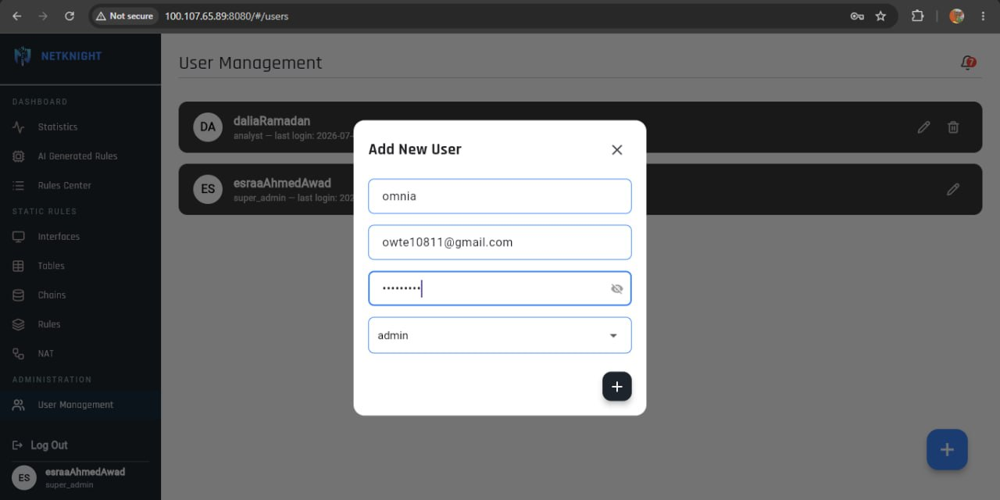 | Adding a new user to the system |
| 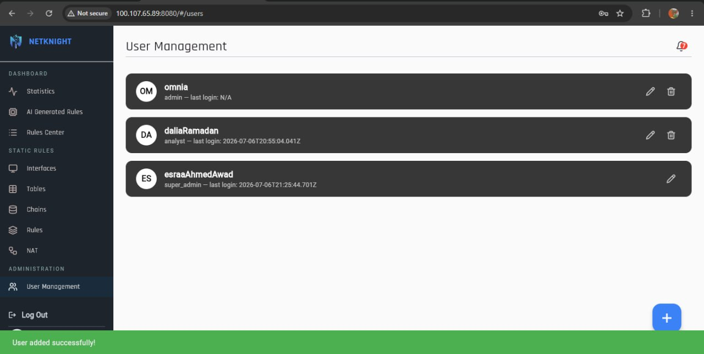 | Confirmation that the user has been successfully added |

### 2. Interface Configuration
| Screenshot | Description |
|---|---|
| 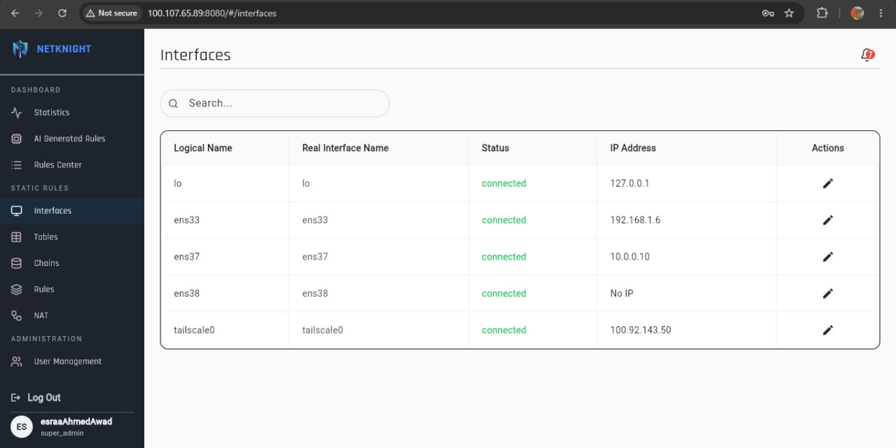 | Interface configuration GUI before any changes |
| 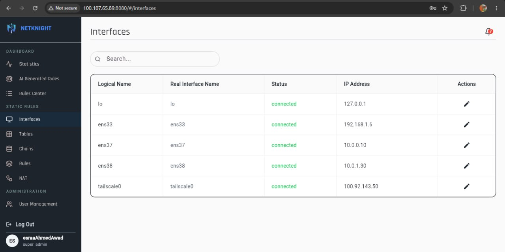 | Interface configuration GUI after editing settings |
| 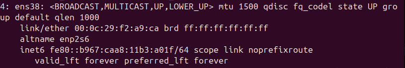 | Actual network interface state before configuration |
| 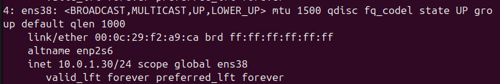 | Actual network interface state after configuration is applied |

### 3. Rules & Chains
| Screenshot | Description |
|---|---|
| 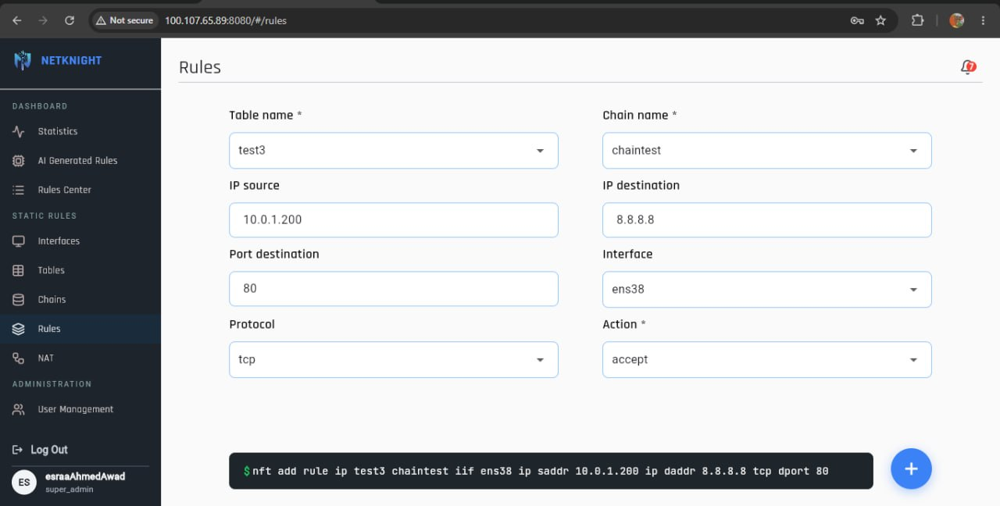 | Interface for creating and managing firewall rules |
|  | Interface for managing firewall chains |
|  | Applying a rule within a specific chain |
| 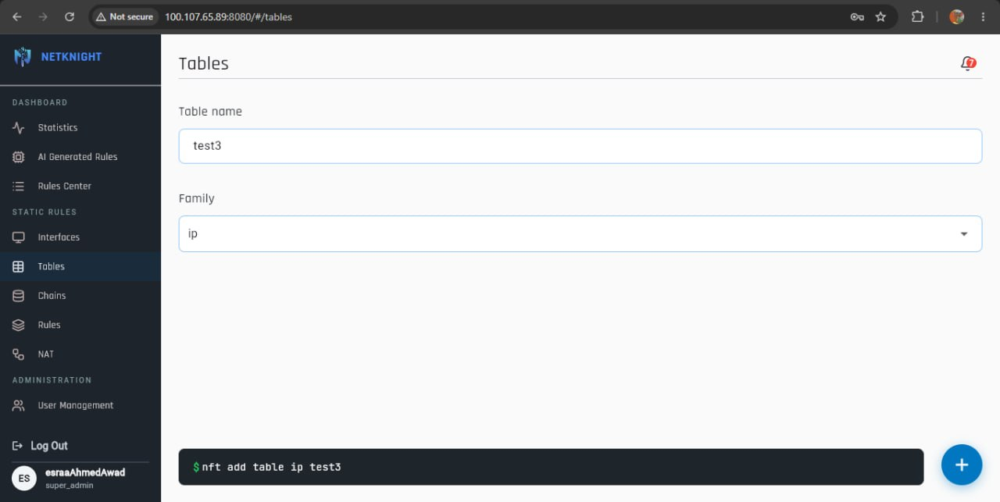 | Firewall table management interface |
|  | Applying changes to a firewall table |

### 4. NAT Configuration
| Screenshot | Description |
|---|---|
| 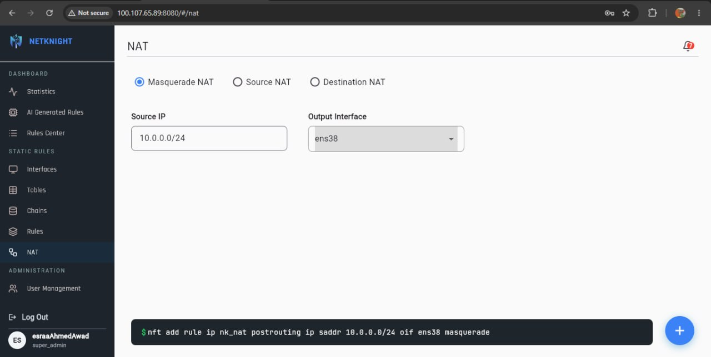 | NAT (Network Address Translation) configuration interface |
|  | Applying NAT settings to the network |

### 5. Attack Simulation & Firewall Response
| Screenshot | Description |
|---|---|
| 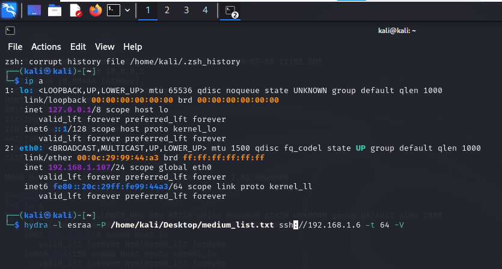 | Simulated attack pattern used to test whether the firewall detects it |
| 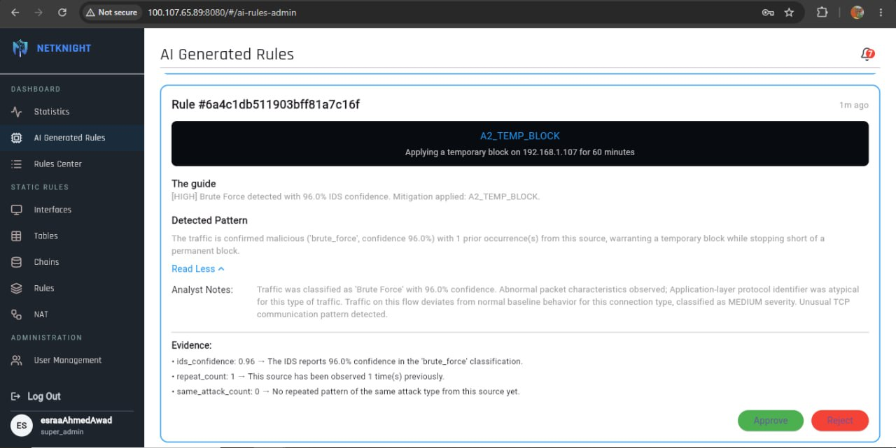 | Auto-generated rule shown before review and approval |
|  | The rule after being reviewed and approved |
| 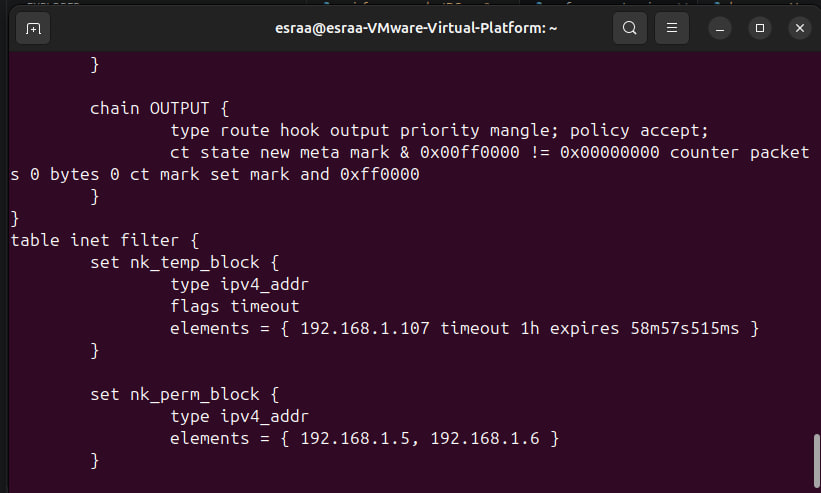 | The approved rule actively enforced — matching traffic is now blocked |

## 👥 Team Members
* Alaa Ramadan Ibrahim as AI Engineer
* Esraa Ahmed Awad as Backend Developer
* Esraa Hussein Abd El-Haleem as Network Enginner
* Dalia Ramadan Ahmeda as Flutter Developer
* Omnia Ahmed Arafa as Flutter Developer
* Ashraqat Mohamed Ibrahim as AI Engineer
